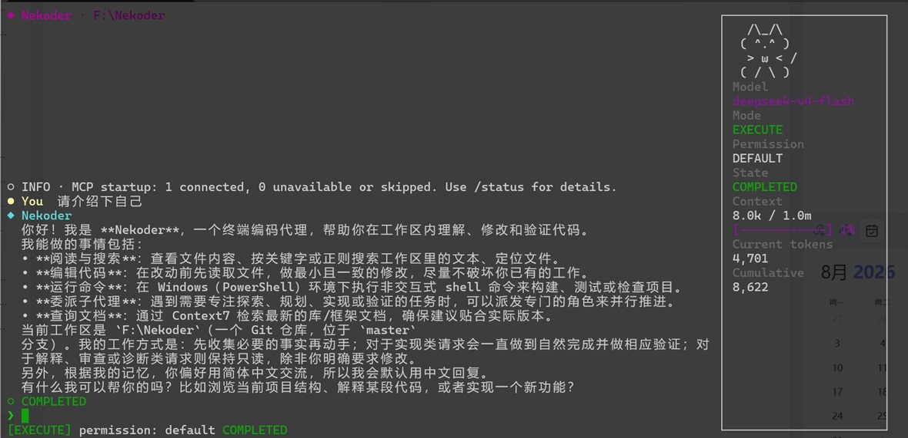

# Nekoder

Nekoder 是一个运行在终端中的 AI 编程助手。它以 Agent Run 为核心，把模型对话、代码检索与编辑、命令执行、MCP、Skills、子 Agent、会话和长期记忆整合进同一个 TUI，并通过分级权限与逐次审批控制副作用。



## 项目功能

- 基于 Bun、React 19 和 Ink 7 的流式终端界面，展示推理文本、工具调用、审批状态、Token 用量与运行结果。
- 支持 Anthropic、OpenAI 和 OpenAI-compatible Provider，可在当前进程中切换模型。
- 内置文件读取、查找、搜索、写入、精确编辑与命令执行工具，并可通过 MCP 扩展工具集合。
- 支持 Execute 与 Plan→Do 工作流；Plan 模式禁止写入，确认计划后再执行。
- 支持持久化 Session、自动上下文压缩、用户/项目两级长期记忆及大型工具结果落盘。
- 支持项目或用户级 Skills、Hooks、Agent Definition，以及共享目录或独立 Git worktree 中的子 Agent。
- 提供五种 Permission Mode、规则化授权、敏感读取审批、危险命令阻断和终端内容净化。

## 如何运行

### 环境要求

- [Bun](https://bun.sh/)；
- 支持交互输入和 ANSI 的终端；
- 正式模式需要可用的模型 Provider 与 API Key。

安装依赖并先运行无 API Key 的 Demo：

```powershell
bun install
bun run demo
```

正式模式会依次读取 `~/.nekoder/config.yaml`、工作区根目录的 `config.yaml` 和 `.nekoder/config.yaml`。在任一位置创建配置，例如：

```yaml
providers:
  - name: primary
    protocol: openai
    base_url: https://api.openai.com/v1
    model: YOUR_MODEL
```

将密钥放入环境变量，不要写入仓库：

```powershell
$env:OPENAI_API_KEY = "YOUR_API_KEY"
bun run start
```

Anthropic 使用 `ANTHROPIC_API_KEY`；`openai-compat` 默认也读取 `OPENAI_API_KEY`。常用启动参数：

```text
--workspace <dir>  指定工作区（--cwd 和 -C 为别名）
--demo             无 API Key 运行 Demo
--debug            显示内存 UI 诊断
--plain-icons      不使用 Nerd Font 图标
--reduce-motion    关闭非必要动画
-h, --help         显示帮助
```

类型检查：

```powershell
bunx tsc --noEmit
```

## 项目结构

```text
Nekoder/
├─ src/
│  ├─ agent/          # Agent Run、模式授权与事件队列
│  ├─ config/         # Provider、MCP 与运行参数配置
│  ├─ continuity/     # Session、压缩、记忆、指令与工具产物
│  ├─ conversation/   # 对话消息与 Tool Call/Result 配对
│  ├─ extensions/     # Skills、Hooks、子 Agent 与 worktree
│  ├─ llm/            # 模型客户端、错误映射与 I/O Hook
│  ├─ mcp/            # MCP 连接、命名、适配与信任
│  ├─ prompt/         # 系统提示词和工作区环境组装
│  ├─ security/       # 权限模式、规则、路径与命令分析
│  ├─ slash/          # Slash 命令注册与分发
│  ├─ tool-turn/      # 单轮工具调用编排
│  ├─ tools/          # 核心工具、Registry 与 Runner
│  ├─ tui/            # Ink 界面、输入、状态与审批交互
│  ├─ cli.ts          # 应用装配和 CLI 生命周期
│  └─ index.tsx       # 可执行入口
├─ package.json
├─ tsconfig.json
└─ Nekoder.jpg
```

## 功能详解

### 交互

Nekoder 将一次用户请求作为一个可取消的 Agent Run。模型输出与工具生命周期会实时进入时间线；宽终端会额外显示猫咪状态侧栏，长时间线则使用视口虚拟化。

- `Enter` 提交，`Shift+Enter` 换行；方向键、`Home` / `End`、`Backspace` / `Delete` 编辑草稿。
- `Ctrl+Z` / `Ctrl+Y` 撤销或重做；`PageUp` / `PageDown` 或滚轮浏览时间线。
- `Tab` 在输入开头补全 Slash 命令，在其他位置切换输入区与时间线浏览。
- 审批时使用 `Y` 单次允许、`N` 拒绝；Run 中使用 `Ctrl+C` 或 `Esc` 取消。
- 鼠标支持滚动、工具卡和审批操作，所有鼠标操作都有键盘等价路径。

主要 Slash 命令：

- 工作模式：`/plan`、`/do`、`/execute`（`/exec`）、`/review`；
- 上下文：`/compact`、`/clear`、`/cls`；
- 状态与配置：`/status`、`/provider`（`/model`）、`/permission`；
- 持久化：`/session`、`/memory`；
- 扩展：`/skill-install`、`/skill-create`，以及所有可由用户调用的 Skill 命令。

### 工具

核心 Tool Registry 默认注册六类能力：`read_file`、`find_files`、`search_text`、`write_file`、`edit_file` 和 `run_command`。只读调用可按配置并行执行，写入与执行调用按顺序处理；每次结果都与原始 Tool Call 配对，避免对话状态失真。

MCP 支持 `stdio` 与 HTTP 两种 Transport。工作区首次启用或修改 MCP Server 配置时会请求信任；单个 Server 连接失败不会阻止核心工具启动。HTTP 远端默认要求 HTTPS，loopback 可使用 HTTP，`${VAR}` 只会在显式 `env` 或 `headers` 字段中展开。

扩展系统还提供：

- `use_skill`：按需加载 Skill 指令，并可注册 Skill Worker 暴露的动态工具；
- `delegate_agent` 与 `task_*`：派发、查询、更新或取消有边界的子任务；
- Agent Definition：限制子 Agent 的工具、最大步数、权限模式、Secret 与隔离方式；
- Hook：监听系统、Session、Agent 和 Tool 生命周期，执行提示注入、拒绝、HTTP、命令或子任务动作。

### 记忆

Nekoder 将“继续对话”和“长期知识”分开处理：

- Session Journal 写入 `.nekoder/sessions/*.jsonl`，可通过 `/session list|resume|new|delete` 管理；
- 上下文接近模型窗口上限时，Context Compactor 生成结构化摘要并保留用户请求索引、约束、路径和工具产物引用；
- Memory Note 分为 `preference`、`correction`、`project_knowledge` 和 `reference`，支持用户级 `~/.nekoder/memory` 与项目级 `.nekoder/memory`；
- `/memory list|show|forget` 用于检查和删除记忆，后台记忆作业负责把候选信息整理成 Markdown Note；
- 过大的工具结果写入 `.nekoder/artifacts/<session-id>/`，对话中保留可追踪引用，减轻上下文压力；
- 项目指令可从 `.nekoder/instructions.md` 加载，并与普通参考资料区分信任边界。

### 安全

Permission Mode 决定工具的默认行为：

| 模式 | 默认策略 |
| --- | --- |
| `strict` | 所有可执行工具调用均需单次审批 |
| `plan` | 禁止写入，执行操作需审批 |
| `default` | 读取自动允许，写入和执行需审批 |
| `accept-edit` | 读取与编辑自动允许，执行需审批 |
| `permissive` | 默认允许，启用前需要显式确认 |

授权规则可来自 Session、本地项目、项目共享配置或用户配置，并支持按工具、命令、路径和工作目录匹配。无论当前模式如何，以下安全不变量始终生效：

- Agent 文件工具不能修改权限控制文件或 `.git` 元数据；
- 已识别的危险操作直接拒绝，包含动态拼接的命令只允许单次审批；
- 敏感路径读取必须审批，Plan Task Mode 中写入始终拒绝；
- 命令审批展示完整 `command` 与 `cwd`，持久授权范围会受操作风险上限约束；
- 模型文本、工具数据和路径在渲染前移除 ANSI、OSC 与危险控制字符；
- MCP 配置、可执行 Skill 代码和子 Agent Secret 分别经过信任或授权流程，Secret 值不会直接暴露给模型。

Hook 是刻意保留的高权限扩展点：Hook 中的 HTTP 和命令动作以 Nekoder 进程用户身份运行，不经过普通工具审批。只应加载你完全信任的 Hook 配置。

如需审计完整模型调用，可启用 JSONL I/O Hook：

```yaml
llm_io_hook:
  enabled: true
  path: .nekoder/logs/llm-io.jsonl
```

该日志可能包含提示词、消息、工具定义、结果、错误和敏感数据；请限制访问权限并禁止提交。

## 开源许可

本项目基于 [MIT License](./LICENSE) 开源。
